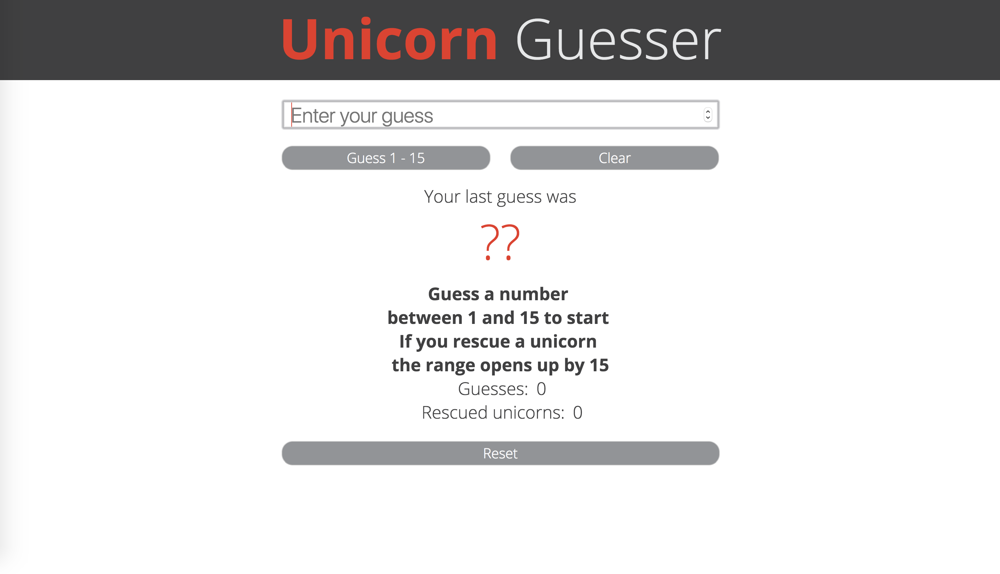
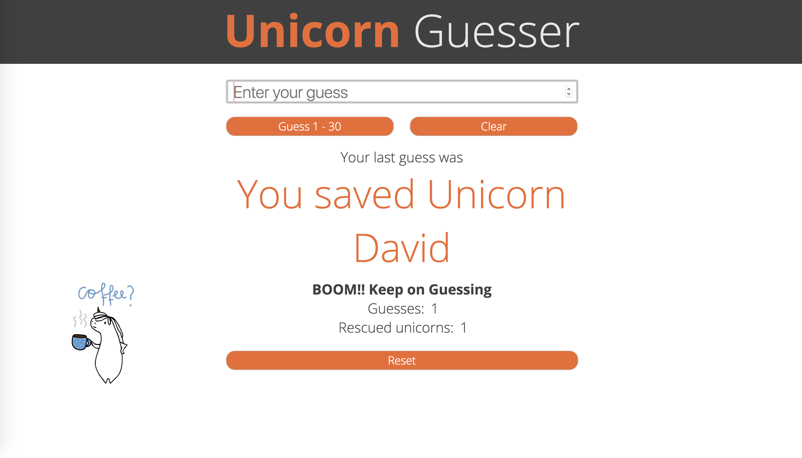

# Unicorn Guesser
Fun extension of [Number Guesser](https://mrayanne113.github.io/number-guesser/) 

This was a Turing School of Software and Design project extension. I took a the simple number guesser game and make it fun for kids. Each time you level up the colors change going through the colors of the rainbow and you resuce an unicorn. Can you save them all?

